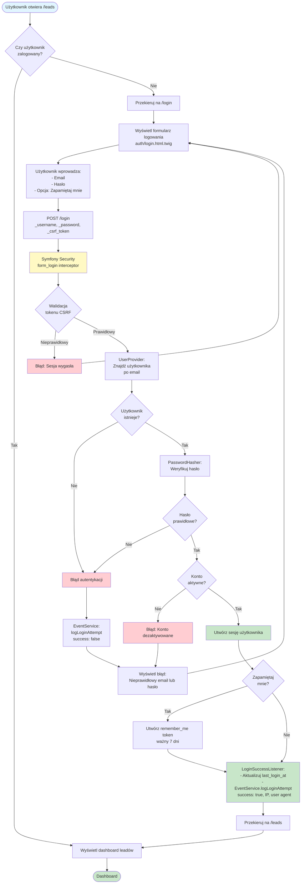
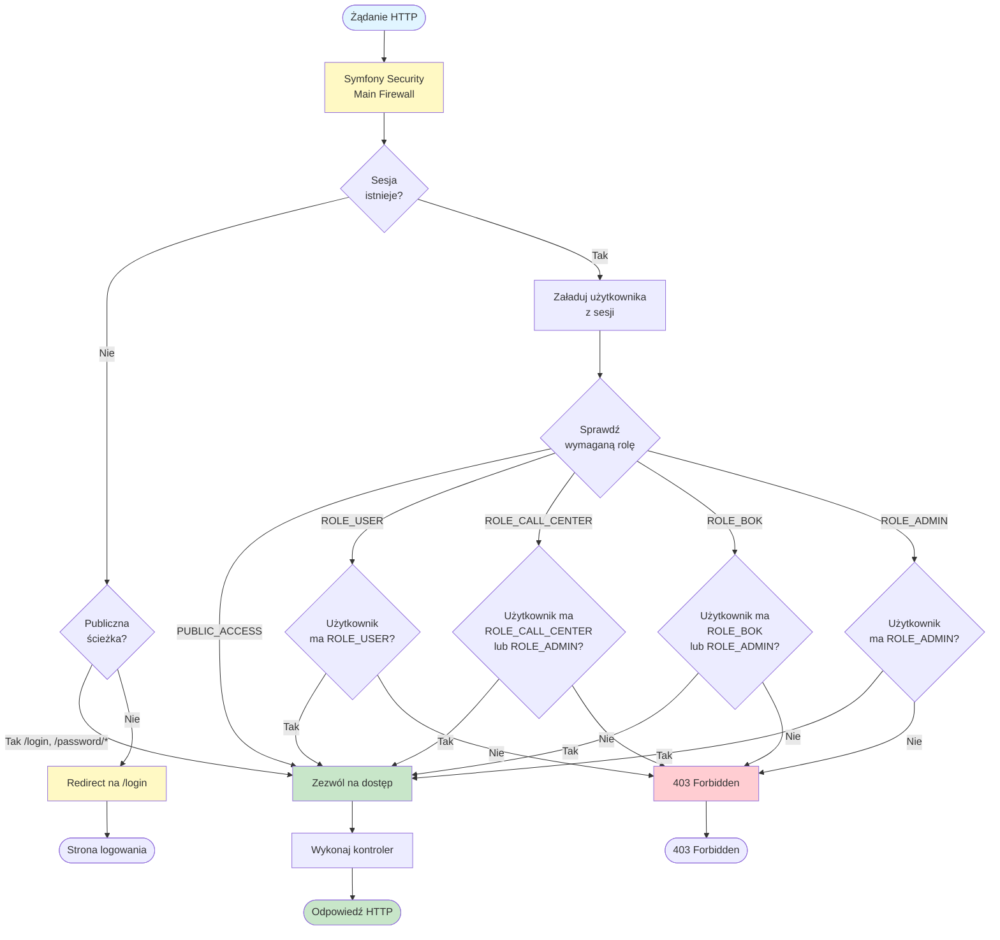
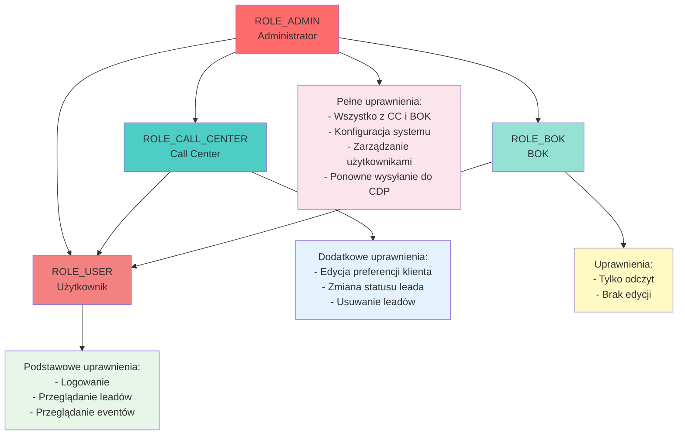
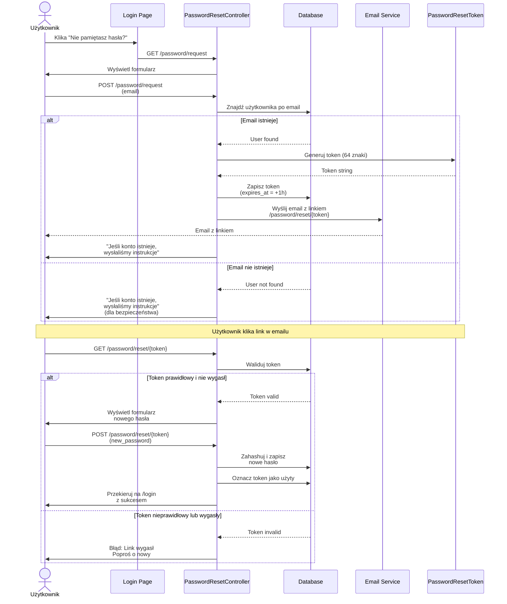
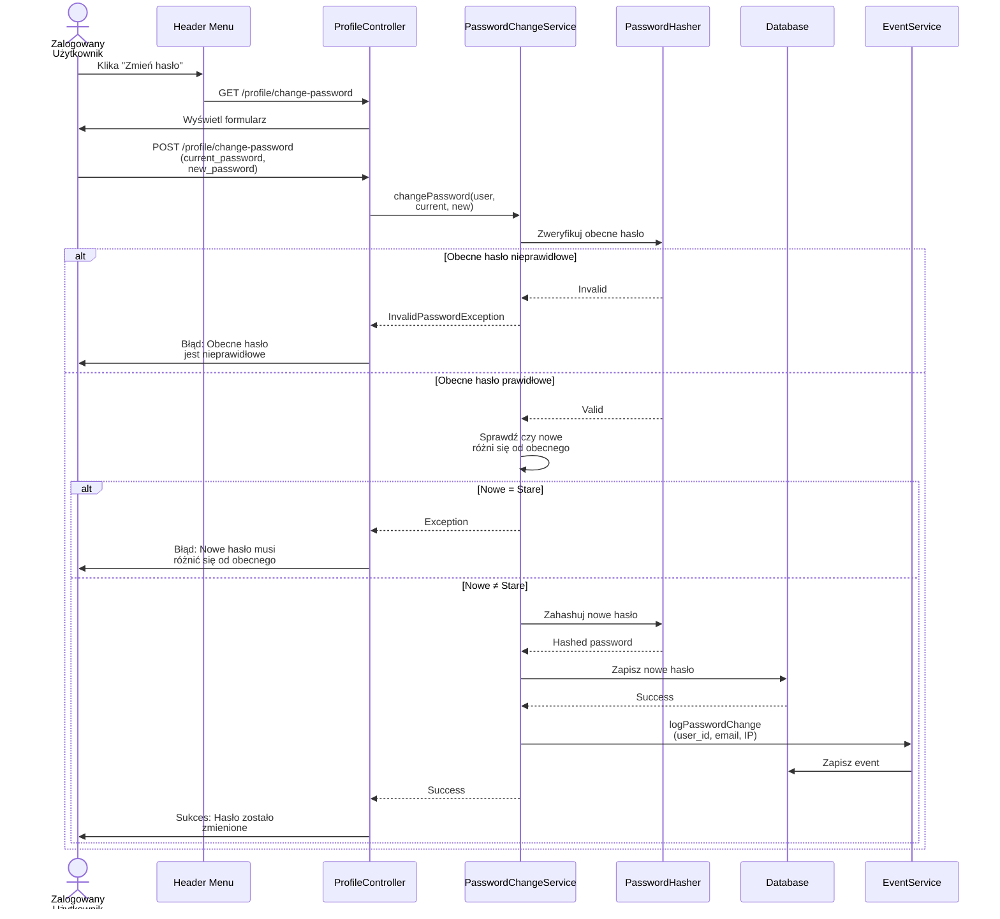
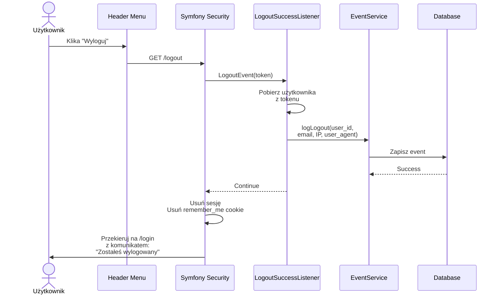
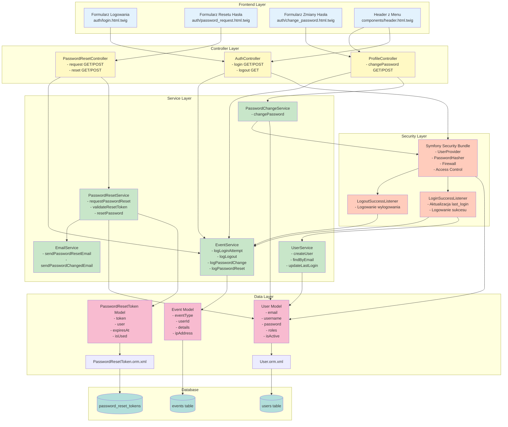
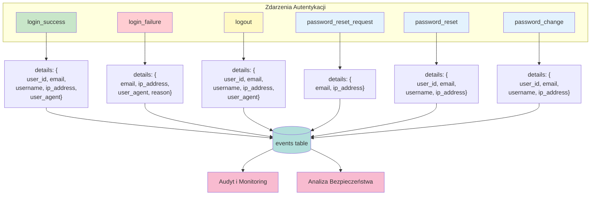

# Diagram Przepływu Autentykacji - LMS

> **Źródła:** PRD (US-002, US-008), auth-spec.md, istniejący codebase  
> **Data:** 2025-10-15

---

## 1. Proces Logowania Użytkownika



---

## 2. Kontrola Dostępu do Zasobów (Access Control)



---

## 3. Hierarchia Ról i Dziedziczenie



---

## 4. Proces Resetowania Hasła



---

## 5. Proces Zmiany Hasła (Zalogowany Użytkownik)



---

## 6. Proces Wylogowania



---

## 7. Architektura Komponentów Autentykacji



---

## 8. Macierz Dostępu - Mapowanie Ścieżek na Role

```mermaid
graph LR
    subgraph "Publiczne (PUBLIC_ACCESS)"
        P1[/login]
        P2[/password/request]
        P3[/password/reset/*]
        P4[/api/*]
    end
    
    subgraph "Wymagana ROLE_USER"
        U1[/profile/*]
        U2[/leads]
        U3[/customers]
        U4[/events]
        U5[/failed-deliveries]
    end
    
    subgraph "Wymagana ROLE_CALL_CENTER"
        CC1[/leads/*/edit]
        CC2[/leads/*/delete]
        CC3[/customers/*/preferences]
    end
    
    subgraph "Wymagana ROLE_ADMIN"
        A1[/config]
        A2[/failed-deliveries/*/retry]
        A3[/users/manage]
    end
    
    style P1 fill:#c8e6c9
    style P2 fill:#c8e6c9
    style P3 fill:#c8e6c9
    style P4 fill:#c8e6c9
    
    style U1 fill:#fff9c4
    style U2 fill:#fff9c4
    style U3 fill:#fff9c4
    style U4 fill:#fff9c4
    style U5 fill:#fff9c4
    
    style CC1 fill:#e3f2fd
    style CC2 fill:#e3f2fd
    style CC3 fill:#e3f2fd
    
    style A1 fill:#ffcdd2
    style A2 fill:#ffcdd2
    style A3 fill:#ffcdd2
```

---

## 9. Logowanie Eventów Autentykacji



---

## 10. Podsumowanie Kluczowych Decyzji

### Identyfikator Logowania
- **Email** jako główny identyfikator (property: email)
- Użytkownik loguje się przez: **email + hasło**
- Username pozostaje jako nazwa wyświetlana

### System Ról (Role Hierarchy)
```
ROLE_ADMIN
├── ROLE_CALL_CENTER
│   └── ROLE_USER
└── ROLE_BOK
    └── ROLE_USER
```

### Bezpieczeństwo
- CSRF Protection: włączona
- Password Hashing: bcrypt (cost: 12)
- Remember Me: 7 dni
- Password Reset Token: 1 godzina
- Session Security: cookie_secure: auto, cookie_samesite: lax

### Logowanie
- Wszystkie operacje autentykacji logowane w tabeli `events`
- Zawiera: user_id, email, username, IP, user_agent, timestamp
- Cele: audyt, analiza bezpieczeństwa, debugging

---

**Koniec diagramu**

