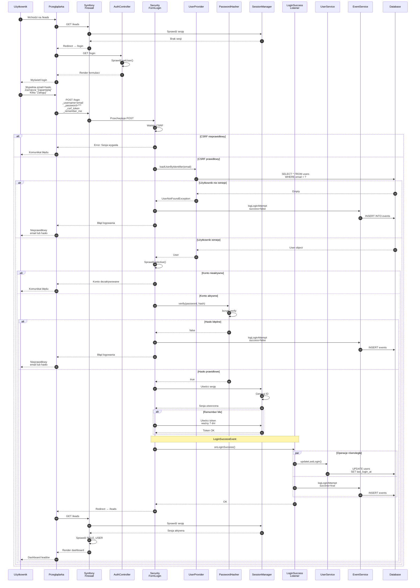
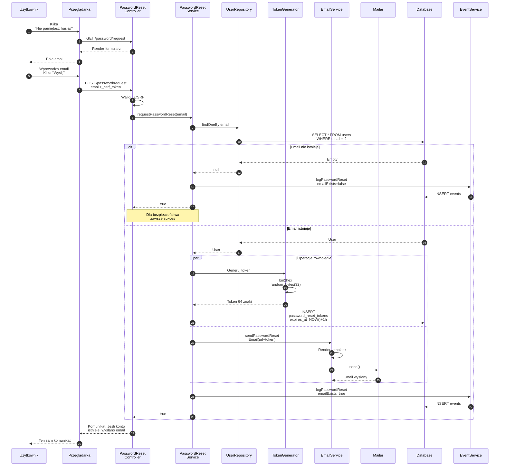
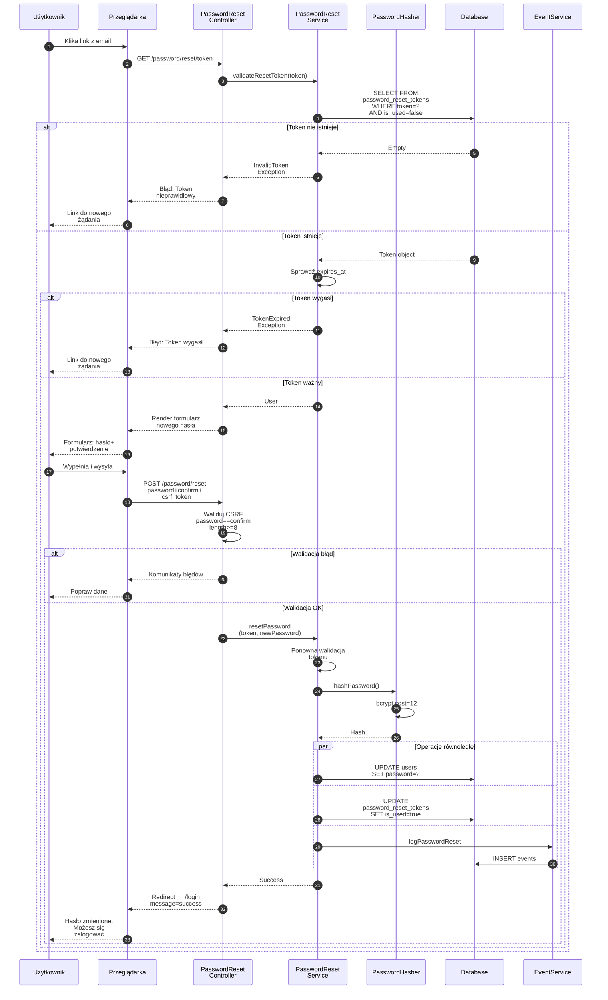
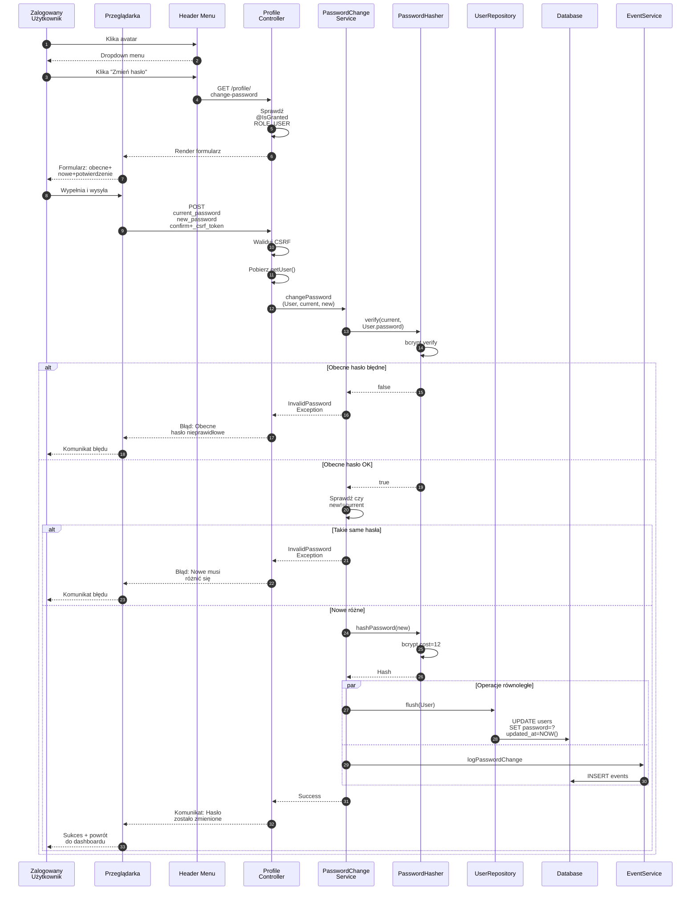
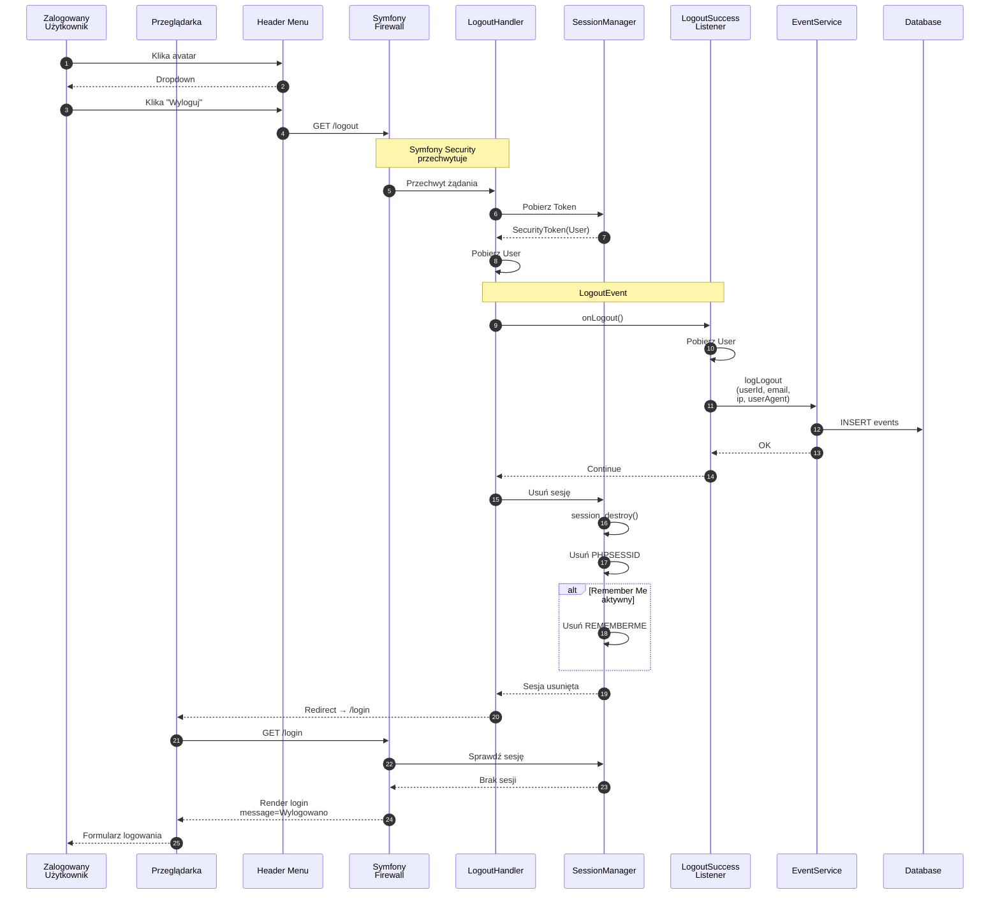

# Diagram Autentykacji - Lead Management System

> **Źródło:** PRD (US-002, US-008), auth-spec.md  
> **Typ:** Sequence Diagram (Mermaid)  
> **Data:** 2025-10-15  
> **Język:** Polski

---

## Przepływ 1: Logowanie Użytkownika



---

## Przepływ 2: Resetowanie Hasła - Żądanie



---

## Przepływ 3: Resetowanie Hasła - Ustawienie Nowego



---

## Przepływ 4: Zmiana Hasła (Zalogowany)



---

## Przepływ 5: Wylogowanie



---

## Architektura Komponentów Autentykacji

### Warstwy systemu:

```
┌─────────────────────────────────────┐
│  Warstwa Prezentacji (Templates)   │
│  - login.html.twig                  │
│  - password_request.html.twig       │
│  - password_reset.html.twig         │
│  - change_password.html.twig        │
└────────────┬────────────────────────┘
             ↓
┌─────────────────────────────────────┐
│  Warstwa Kontrolerów                │
│  - AuthController                   │
│  - PasswordResetController          │
│  - ProfileController                │
└────────────┬────────────────────────┘
             ↓
┌─────────────────────────────────────┐
│  Warstwa Serwisów                   │
│  - UserService                      │
│  - PasswordResetService             │
│  - PasswordChangeService            │
│  - EventService                     │
│  - EmailService                     │
└────────────┬────────────────────────┘
             ↓
┌─────────────────────────────────────┐
│  Symfony Security Bundle            │
│  - Firewall                         │
│  - UserProvider                     │
│  - PasswordHasher                   │
│  - SessionManager                   │
│  - LoginSuccessListener             │
│  - LogoutSuccessListener            │
└────────────┬────────────────────────┘
             ↓
┌─────────────────────────────────────┐
│  Warstwa Danych (Doctrine ORM)      │
│  - UserRepository                   │
│  - User Entity                      │
│  - PasswordResetToken Entity        │
│  - Event Entity                     │
└────────────┬────────────────────────┘
             ↓
┌─────────────────────────────────────┐
│  Baza Danych (MySQL 9.4)            │
│  - users                            │
│  - password_reset_tokens            │
│  - events                           │
└─────────────────────────────────────┘
```

### Kluczowe mechanizmy bezpieczeństwa:

1. **CSRF Protection**
   - Token w każdym formularzu
   - Walidacja przez Symfony Security

2. **Password Hashing**
   - Algorithm: bcrypt
   - Cost: 12

3. **Token Reset Hasła**
   - Długość: 64 znaki
   - Ważność: 1 godzina
   - Jednorazowy użytek

4. **Session Management**
   - Cookie secure (HTTPS)
   - Remember Me: 7 dni
   - Auto-destroy po wylogowaniu

5. **Event Logging**
   - Wszystkie operacje auth
   - IP + User-Agent
   - Timestamp

6. **Role-Based Access Control**
   - ROLE_USER (podstawowy)
   - ROLE_CALL_CENTER (pełny dostęp)
   - ROLE_BOK (read-only)
   - ROLE_ADMIN (administracja)

---

## Operacje na Bazie Danych

| Operacja | Query | Tabela |
|----------|-------|--------|
| Znajdź użytkownika | `SELECT * FROM users WHERE email = ?` | users |
| Update last_login | `UPDATE users SET last_login_at = NOW()` | users |
| Log event | `INSERT INTO events (type, user_id, details)` | events |
| Generuj token reset | `INSERT INTO password_reset_tokens` | password_reset_tokens |
| Waliduj token | `SELECT * WHERE token = ? AND is_used = false` | password_reset_tokens |
| Oznacz token użyty | `UPDATE SET is_used = true` | password_reset_tokens |
| Zmień hasło | `UPDATE users SET password = ?` | users |

---

## Komunikaty Błędów (Przyjazne UX)

| Sytuacja | Komunikat użytkownika |
|----------|----------------------|
| Nieprawidłowy email/hasło | "Nieprawidłowy email lub hasło" |
| CSRF token invalid | "Twoja sesja wygasła. Spróbuj ponownie" |
| Konto nieaktywne | "Twoje konto zostało dezaktywowane" |
| Token reset wygasł | "Link wygasł. Poproś o nowy" |
| Token reset nieprawidłowy | "Link jest nieprawidłowy lub został już użyty" |
| Hasło za krótkie | "Hasło musi mieć co najmniej 8 znaków" |
| Hasła nie pasują | "Hasła muszą być identyczne" |
| Obecne hasło błędne | "Obecne hasło jest nieprawidłowe" |
| Nowe = stare | "Nowe hasło musi różnić się od obecnego" |

---

**Koniec dokumentacji diagramów autentykacji**

