```mermaid
stateDiagram-v2
    [*] --> WejscieNaStrone: Użytkownik otwiera aplikację
    
    state "Sprawdzenie Autentykacji" as SprawdzenieAuth
    WejscieNaStrone --> SprawdzenieAuth
    
    state if_zalogowany <<choice>>
    SprawdzenieAuth --> if_zalogowany
    if_zalogowany --> Dashboard: Zalogowany
    if_zalogowany --> FormularzLogowania: Niezalogowany
    
    state "Moduł Autentykacji" as Autentykacja {
        state "Proces Logowania" as ProcesLogowania {
            FormularzLogowania: Formularz logowania
            note right of FormularzLogowania
                Email + Hasło
                Opcja: Zapamiętaj mnie
                Link: Nie pamiętasz hasła?
            end note
            
            FormularzLogowania --> WalidacjaFormularza: Wysłanie formularza
            
            state if_walidacja <<choice>>
            WalidacjaFormularza --> if_walidacja
            if_walidacja --> WeryfikacjaCSRF: Dane poprawne
            if_walidacja --> BladFormularza: Dane niepoprawne
            
            BladFormularza --> FormularzLogowania: Wyświetl błędy
            
            WeryfikacjaCSRF --> WyszukiwanieUzytkownika
            
            state if_uzytkownik <<choice>>
            WyszukiwanieUzytkownika --> if_uzytkownik
            if_uzytkownik --> WeryfikacjaHasla: Użytkownik znaleziony
            if_uzytkownik --> BladAutentykacji: Użytkownik nie istnieje
            
            state if_haslo <<choice>>
            WeryfikacjaHasla --> if_haslo
            if_haslo --> SprawdzenieStatusuKonta: Hasło poprawne
            if_haslo --> BladAutentykacji: Hasło niepoprawne
            
            state if_status <<choice>>
            SprawdzenieStatusuKonta --> if_status
            if_status --> TworzenieeSesji: Konto aktywne
            if_status --> BladKontoDezaktywowane: Konto nieaktywne
            
            state fork_sukces <<fork>>
            state join_sukces <<join>>
            
            TworzenieeSesji --> fork_sukces
            fork_sukces --> AktualizacjaLastLogin: Aktualizuj last_login_at
            fork_sukces --> LogowanieEventu: Loguj login_success
            fork_sukces --> TworzenieTokenuRememberMe: Jeśli zaznaczono
            
            AktualizacjaLastLogin --> join_sukces
            LogowanieEventu --> join_sukces
            TworzenieTokenuRememberMe --> join_sukces
            
            join_sukces --> SukcesLogowania
            
            BladAutentykacji --> LogowanieBledu: Loguj login_failure
            LogowanieBledu --> WyswietlenieBledu
            WyswietlenieBledu --> FormularzLogowania
            
            BladKontoDezaktywowane --> WyswietlenieBledu
        }
        
        state "Proces Resetowania Hasła" as ProcesResetu {
            ZadanieResetu: Żądanie resetu hasła
            note right of ZadanieResetu
                Formularz z polem email
            end note
            
            ZadanieResetu --> WyszukiwanieEmaila
            
            state if_email <<choice>>
            WyszukiwanieEmaila --> if_email
            
            state fork_email <<fork>>
            if_email --> fork_email: Email istnieje
            fork_email --> GenerowanieTokenu
            fork_email --> WyslanieEmaila
            
            state join_email <<join>>
            GenerowanieTokenu --> join_email
            WyslanieEmaila --> join_email
            
            join_email --> KomunikatWyslano
            if_email --> KomunikatWyslano: Email nie istnieje
            
            note right of KomunikatWyslano
                Zawsze ten sam komunikat
                dla bezpieczeństwa
            end note
            
            KomunikatWyslano --> OczekiwanieNaKlikLink: Użytkownik sprawdza email
            
            OczekiwanieNaKlikLink --> FormularzNowegoHasla: Kliknięcie linku
            
            state if_token <<choice>>
            FormularzNowegoHasla --> WalidacjaTokenu
            WalidacjaTokenu --> if_token
            if_token --> IntrodukcjaNowegoHasla: Token ważny
            if_token --> BladTokenWygasl: Token wygasł lub użyty
            
            BladTokenWygasl --> ZadanieResetu: Poproś o nowy
            
            IntrodukcjaNowegoHasla --> ZapisNowegoHasla
            ZapisNowegoHasla --> OznaczTokenJakoUzyty
            OznaczTokenJakoUzyty --> LogowanieResetuHasla
            LogowanieResetuHasla --> SukcesResetuHasla
        }
        
        SukcesLogowania --> Dashboard
        SukcesResetuHasla --> FormularzLogowania: Przekieruj z komunikatem sukcesu
    }
    
    state "System Zalogowany" as SystemZalogowany {
        Dashboard: Dashboard Leadów
        note right of Dashboard
            Wyświetla leady
            Header z menu użytkownika
            Sidebar z nawigacją
        end note
        
        state "Operacje na Zasobach" as OperacjeZasoby {
            Dashboard --> PrzeglądanieLeadow
            Dashboard --> PrzeglądanieKlientow
            Dashboard --> PrzeglądanieEventow
            Dashboard --> PrzeglądanieNieudanych
            Dashboard --> KonfiguracjaSystemu: Tylko ROLE_ADMIN
            
            PrzeglądanieLeadow --> EdycjaPreferencji: ROLE_CALL_CENTER lub ADMIN
            PrzeglądanieLeadow --> UsuwanieLeadow: ROLE_CALL_CENTER lub ADMIN
            
            state if_role <<choice>>
            PrzeglądanieLeadow --> if_role
            if_role --> OperacjeOdczytu: ROLE_BOK
            if_role --> OperacjeEdycji: ROLE_CALL_CENTER
            if_role --> OperacjePelne: ROLE_ADMIN
            
            OperacjeOdczytu --> PrzeglądanieLeadow
            OperacjeEdycji --> PrzeglądanieLeadow
            OperacjePelne --> PrzeglądanieLeadow
        }
        
        state "Zarządzanie Profilem" as ZarzadzanieProfil {
            Dashboard --> MenuUzytkownika: Kliknięcie avatar
            
            state "Zmiana Hasła" as ZmianaHaslaProces {
                MenuUzytkownika --> FormularzZmianyHasla
                
                FormularzZmianyHasla --> WeryfikacjaObecnegoHasla
                
                state if_obecne_haslo <<choice>>
                WeryfikacjaObecnegoHasla --> if_obecne_haslo
                if_obecne_haslo --> SprawdzenieNowegoHasla: Obecne hasło poprawne
                if_obecne_haslo --> BladObecneHaslo: Obecne hasło niepoprawne
                
                BladObecneHaslo --> FormularzZmianyHasla
                
                state if_nowe_haslo <<choice>>
                SprawdzenieNowegoHasla --> if_nowe_haslo
                if_nowe_haslo --> ZapisanieNowegoHasla: Nowe różne od starego
                if_nowe_haslo --> BladTakieSameHaslo: Nowe takie samo
                
                BladTakieSameHaslo --> FormularzZmianyHasla
                
                ZapisanieNowegoHasla --> LogowanieZmianyHasla
                LogowanieZmianyHasla --> SukcesZmianyHasla
                SukcesZmianyHasla --> Dashboard
            }
            
            MenuUzytkownika --> ProceWylogowania: Wyloguj
            
            state "Wylogowanie" as ProceWylogowania {
                PoczatekWylogowania --> UsunięcieSesji
                UsunięcieSesji --> LogowanieWylogowania
                LogowanieWylogowania --> KoniecWylogowania
            }
        }
    }
    
    KoniecWylogowania --> FormularzLogowania: Przekieruj z komunikatem
    
    FormularzLogowania --> ZadanieResetu: Link "Nie pamiętasz hasła?"
    
    Dashboard --> [*]: Zakończenie pracy
    
    note left of SprawdzenieAuth
        Symfony Security Firewall
        sprawdza sesję użytkownika
    end note
    
    note right of Dashboard
        Dostępne zasoby:
        - Leady (wszyscy)
        - Klienci (wszyscy)
        - Eventy (wszyscy)
        - Nieudane dostawy (wszyscy)
        - Konfiguracja (tylko ADMIN)
    end note
```

---

# Diagram Podróży Użytkownika - Moduł Autentykacji LMS

> **Źródło:** PRD (US-002, US-008), auth-spec.md  
> **Typ diagramu:** State Diagram v2 (User Journey)  
> **Data utworzenia:** 2025-10-15

---

## Opis Głównych Ścieżek

### 1. 🔐 Ścieżka Logowania (Podstawowa)

**Aktor:** Niezalogowany użytkownik  
**Cel:** Uzyskanie dostępu do systemu LMS

**Kroki:**
1. Użytkownik próbuje wejść na chronioną stronę (np. `/leads`)
2. System sprawdza autentykację → Niezalogowany
3. Przekierowanie na formularz logowania
4. Wprowadzenie email + hasło (opcjonalnie: zapamiętaj mnie)
5. Walidacja formularza (HTML5 + CSRF)
6. Wyszukiwanie użytkownika w bazie po email
7. Weryfikacja hasła (bcrypt)
8. Sprawdzenie czy konto aktywne
9. Utworzenie sesji + aktualizacja last_login + logowanie eventu
10. Przekierowanie na dashboard leadów

**Punkty decyzyjne:**
- Email istnieje? → Tak: Dalej | Nie: Błąd autentykacji
- Hasło poprawne? → Tak: Dalej | Nie: Błąd + Event
- Konto aktywne? → Tak: Sesja | Nie: Błąd dezaktywacji

**Rezultat:**
- ✅ Sukces: Użytkownik w dashboardzie z aktywną sesją
- ❌ Błąd: Powrót do formularza z komunikatem błędu

---

### 2. 🔑 Ścieżka Resetowania Hasła

**Aktor:** Niezalogowany użytkownik (zapomniał hasła)  
**Cel:** Ustawienie nowego hasła

**Kroki:**
1. Kliknięcie "Nie pamiętasz hasła?" na stronie logowania
2. Wprowadzenie adresu email
3. System szuka email w bazie
4. **Jeśli email istnieje:**
   - Generowanie tokenu (64 znaki, ważny 1h)
   - Wysłanie emaila z linkiem `/password/reset/{token}`
5. **Komunikat (zawsze ten sam):** "Jeśli konto istnieje, wysłaliśmy instrukcje"
6. Użytkownik klika link w emailu
7. Walidacja tokenu (ważny? nie użyty? nie wygasł?)
8. Formularz nowego hasła + potwierdzenie
9. Zapisanie nowego hasła (hashed)
10. Oznaczenie tokenu jako użytego
11. Logowanie eventu password_reset
12. Przekierowanie na login z komunikatem sukcesu

**Punkty decyzyjne:**
- Email w bazie? → Zawsze ten sam komunikat (bezpieczeństwo)
- Token ważny? → Tak: Formularz | Nie: Błąd + link do ponownego żądania

**Rezultat:**
- ✅ Sukces: Nowe hasło ustawione, możliwość logowania
- ❌ Błąd: Token wygasł → Prośba o nowy

---

### 3. 👤 Ścieżka Zmiany Hasła (Zalogowany)

**Aktor:** Zalogowany użytkownik  
**Cel:** Zmiana hasła z poziomu profilu

**Kroki:**
1. Menu użytkownika → "Zmień hasło"
2. Formularz: obecne hasło + nowe hasło + potwierdzenie
3. Weryfikacja obecnego hasła
4. Sprawdzenie czy nowe różni się od obecnego
5. Zapisanie nowego hasła
6. Logowanie eventu password_change
7. Komunikat sukcesu + powrót do dashboardu

**Punkty decyzyjne:**
- Obecne hasło poprawne? → Tak: Dalej | Nie: Błąd
- Nowe różne od starego? → Tak: Zapisz | Nie: Błąd

**Rezultat:**
- ✅ Sukces: Hasło zmienione, sesja aktywna
- ❌ Błąd: Powrót do formularza z błędem

---

### 4. 📊 Ścieżka Pracy w Systemie

**Aktor:** Zalogowany użytkownik (dowolna rola)  
**Cel:** Wykonywanie operacji na zasobach

**Dashboard jako hub:**
- Przeglądanie leadów
- Przeglądanie klientów
- Przeglądanie eventów
- Przeglądanie nieudanych dostaw
- Konfiguracja systemu (tylko ADMIN)

**Kontrola dostępu według roli:**

**ROLE_BOK:**
- ✅ Przeglądanie (read-only)
- ❌ Edycja
- ❌ Usuwanie

**ROLE_CALL_CENTER:**
- ✅ Przeglądanie
- ✅ Edycja preferencji klienta
- ✅ Zmiana statusu leada
- ✅ Usuwanie leadów

**ROLE_ADMIN:**
- ✅ Wszystko z CALL_CENTER i BOK
- ✅ Konfiguracja systemu
- ✅ Zarządzanie użytkownikami
- ✅ Ponowne wysyłanie do CDP

---

### 5. 🚪 Ścieżka Wylogowania

**Aktor:** Zalogowany użytkownik  
**Cel:** Zakończenie sesji

**Kroki:**
1. Menu użytkownika → "Wyloguj"
2. GET `/logout` (przechwytywany przez Symfony Security)
3. Usunięcie sesji + usunięcie remember_me cookie
4. Logowanie eventu logout
5. Przekierowanie na login z komunikatem "Zostałeś wylogowany"

**Rezultat:**
- ✅ Sesja zakończona, użytkownik niezalogowany

---

## Stany Równoległe

### Równoległe operacje po sukcesie logowania:

```
TworzenieeSesji →
    ├→ AktualizacjaLastLogin (UPDATE users SET last_login_at)
    ├→ LogowanieEventu (INSERT INTO events)
    └→ TworzenieTokenuRememberMe (jeśli zaznaczono checkbox)
    → JOIN → Dashboard
```

### Równoległe operacje przy żądaniu resetu hasła:

```
Email istnieje →
    ├→ GenerowanieTokenu (INSERT INTO password_reset_tokens)
    └→ WyslanieEmaila (Email Service)
    → JOIN → KomunikatWyslano
```

---

## Punkty Kontaktu z Backendem

| Stan w Diagramie | Komponent Backend | Akcja |
|------------------|-------------------|-------|
| WalidacjaFormularza | Symfony Validator | Walidacja DTO |
| WeryfikacjaCSRF | Symfony Security | Sprawdzenie tokenu |
| WyszukiwanieUzytkownika | UserProvider | findByEmail() |
| WeryfikacjaHasla | PasswordHasher | verify() |
| TworzenieeSesji | Symfony Security | Utworzenie sesji |
| LogowanieEventu | EventService | logLoginAttempt() |
| GenerowanieTokenu | PasswordResetService | requestPasswordReset() |
| WyslanieEmaila | EmailService | sendPasswordResetEmail() |
| ZapisNowegoHasla | PasswordResetService | resetPassword() |
| UsunięcieSesji | Symfony Security | Logout handler |

---

## Obsługa Błędów w Podróży

### Typy błędów i powrót do stanu:

| Błąd | Stan powrotu | Komunikat |
|------|--------------|-----------|
| Nieprawidłowy email lub hasło | FormularzLogowania | "Nieprawidłowy email lub hasło" |
| Konto dezaktywowane | FormularzLogowania | "Konto dezaktywowane. Skontaktuj się z administratorem" |
| Token CSRF nieprawidłowy | FormularzLogowania | "Sesja wygasła. Spróbuj ponownie" |
| Token resetujący wygasł | ZadanieResetu | "Link wygasł. Poproś o nowy" |
| Obecne hasło nieprawidłowe | FormularzZmianyHasla | "Obecne hasło jest nieprawidłowe" |
| Nowe hasło takie samo | FormularzZmianyHasla | "Nowe hasło musi różnić się od obecnego" |

---

## Metryki Sukcesu Podróży

**KPI do monitorowania:**

1. **Conversion Rate Logowania:** % udanych logowań / wszystkie próby
2. **Time to Login:** Średni czas od otwarcia strony do dashboardu
3. **Password Reset Rate:** % użytkowników resetujących hasło
4. **Session Duration:** Średni czas sesji użytkownika
5. **Error Rate:** % błędów autentykacji

**Cele biznesowe (z PRD):**
- Dostępność systemu: 99.9%
- Czas odpowiedzi: max 3 sekundy
- Skuteczność deduplikacji: 95%

---

**Koniec dokumentacji User Journey**

