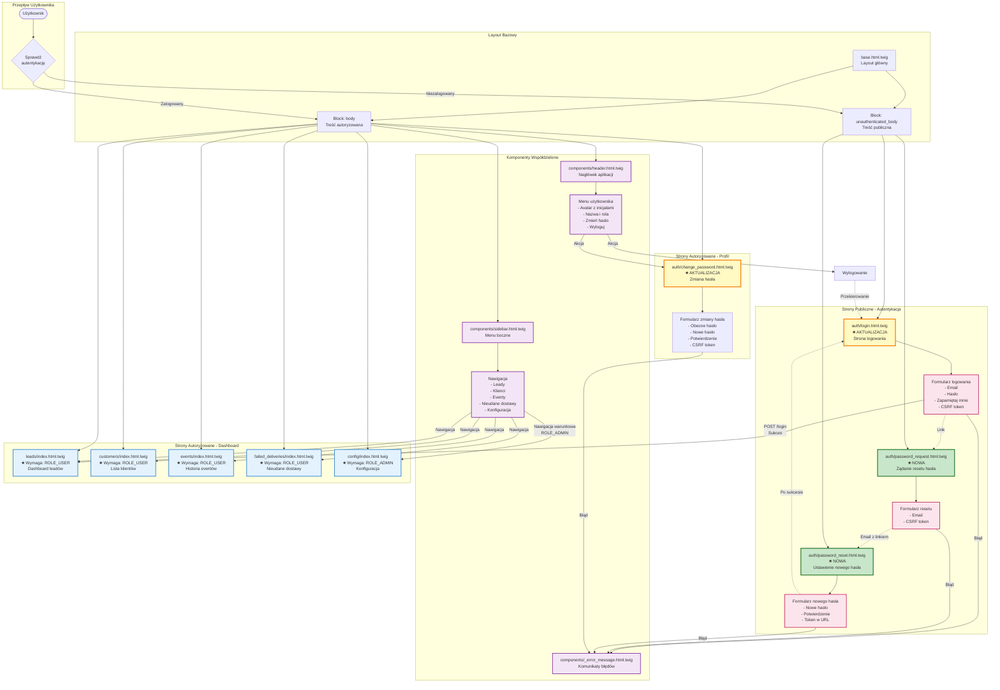

---

# Diagram Architektury UI - Moduł Autentykacji LMS

> **Źródło:** PRD (US-002, US-008), auth-spec.md, istniejący codebase  
> **Data utworzenia:** 2025-10-15  
> **Status:** Specyfikacja wdrożenia

---

## Legenda Kolorów

- 🟢 **Zielony** - Nowe komponenty do utworzenia
- 🟡 **Żółty** - Istniejące komponenty wymagające aktualizacji
- 🔵 **Niebieski** - Strony chronione autentykacją
- 🟣 **Fioletowy** - Komponenty współdzielone (header, sidebar)
- 🔴 **Różowy** - Formularze publiczne

---

## Kluczowe Decyzje Architektoniczne UI

### 1. Podział na Bloki Layout

**base.html.twig** wykorzystuje dwa bloki:
- `` - dla treści wymagającej autentykacji (dashboard, profil)
- `` - dla stron publicznych (logowanie, reset hasła)

**Zalety:**
- Wyraźne rozdzielenie stron publicznych od chronionych
- Strony publiczne nie ładują niepotrzebnych komponentów (sidebar, header z menu)
- Łatwe utrzymanie i testowanie

### 2. Komponenty Współdzielone

**components/header.html.twig:**
- Wyświetla się tylko dla zalogowanych użytkowników
- Menu użytkownika z warunkami: ``
- Avatar z inicjałami dynamicznie generowany z nazwy użytkownika

**components/sidebar.html.twig:**
- Nawigacja warunkowa według ról
- Link "Konfiguracja" widoczny tylko dla `ROLE_ADMIN`
- Aktywna pozycja menu podświetlona

### 3. Formularze Autentykacji

Wszystkie formularze zawierają:
- **CSRF token** - ochrona przed atakami CSRF
- **Walidacja HTML5** - podstawowa walidacja po stronie przeglądarki
- **Fluent Design System** - spójny wygląd z resztą aplikacji
- **Komunikaty błędów** - jasne informacje dla użytkownika

### 4. Przepływ Nawigacji

**Scenariusz 1: Niezalogowany użytkownik**
```
Wejście na /leads → Sprawdzenie auth → Przekierowanie na /login → Logowanie → Dashboard /leads
```

**Scenariusz 2: Zalogowany użytkownik**
```
Header menu → Zmień hasło → /profile/change-password → Zmiana hasła → Powrót do dashboard
```

**Scenariusz 3: Reset hasła**
```
/login → Link "Nie pamiętasz hasła?" → /password/request → Email → Link w emailu → /password/reset/{token} → /login
```

### 5. Kontrola Dostępu w UI

**Warunkowe wyświetlanie elementów:**

```twig
{# Przycisk edycji - tylko dla CALL_CENTER i ADMIN #}

    <fluent-button>Edytuj</fluent-button>


{# Link konfiguracji - tylko dla ADMIN #}

    <a href="{{ path('config_index') }}">Konfiguracja</a>

```

### 6. Responsywność i UX

- **Fluent Design System** - Microsoft Fluent UI Web Components
- **HTMX** - dynamiczne ładowanie bez pełnego odświeżania strony
- **Fokus na dostępność** - labels dla wszystkich pól, autofocus na pierwszym polu
- **Mobile-first** - responsywny layout dostosowany do urządzeń mobilnych

### 7. Walidacja i Obsługa Błędów

**Walidacja kaskadowa:**
1. **HTML5** - podstawowa walidacja (required, email, minlength)
2. **JavaScript** - porównanie haseł przed wysłaniem
3. **Backend** - pełna walidacja Symfony Validator
4. **UI Feedback** - wyświetlenie błędów w komponencie `_error_message.html.twig`

---

## Mapowanie Komponentów na Kontrolery

| Komponent UI | Kontroler | Metoda | Rola wymagana |
|--------------|-----------|--------|---------------|
| `auth/login.html.twig` | `AuthController` | `login()` | PUBLIC |
| `auth/password_request.html.twig` | `PasswordResetController` | `request()` | PUBLIC |
| `auth/password_reset.html.twig` | `PasswordResetController` | `reset()` | PUBLIC |
| `auth/change_password.html.twig` | `ProfileController` | `changePassword()` | ROLE_USER |
| `leads/index.html.twig` | `LeadsViewController` | `index()` | ROLE_USER |
| `customers/index.html.twig` | `CustomersViewController` | `index()` | ROLE_USER |
| `events/index.html.twig` | `EventsViewController` | `index()` | ROLE_USER |
| `failed_deliveries/index.html.twig` | `FailedDeliveriesController` | `index()` | ROLE_USER |
| `config/index.html.twig` | `ConfigViewController` | `index()` | ROLE_ADMIN |

---

## Checklist Implementacji UI

### Strony do Utworzenia
- [ ] `templates/auth/password_request.html.twig`
- [ ] `templates/auth/password_reset.html.twig`
- [ ] `templates/emails/password_reset.html.twig`

### Strony do Aktualizacji
- [ ] `templates/auth/login.html.twig` - dodać obsługę błędów, CSRF, remember me, link do resetu
- [ ] `templates/auth/change_password.html.twig` - zmienić z stub na funkcjonalny formularz

### Komponenty do Weryfikacji
- [ ] `templates/components/header.html.twig` - sprawdzić czy poprawnie obsługuje `app.user`
- [ ] `templates/components/sidebar.html.twig` - dodać warunkowe wyświetlanie dla ról
- [ ] `templates/components/_error_message.html.twig` - używany w formularzach auth

### Chronione Strony
- [ ] Odkomentować `#[IsGranted('ROLE_USER')]` w kontrolerach:
  - `LeadsViewController`
  - `CustomersViewController`
  - `EventsViewController`
  - `FailedDeliveriesController`
- [ ] Odkomentować `#[IsGranted('ROLE_ADMIN')]` w `ConfigViewController`

---

**Koniec dokumentacji UI**

